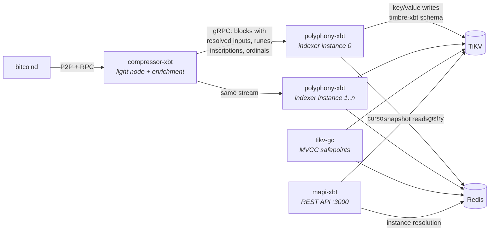

# Maestro Bitcoin Indexer

[](https://github.com/maestro-org/maestro-bitcoin-indexer/actions/workflows/ci.yml)
[](./LICENSE)

**A production-scale, distributed Bitcoin indexing stack** — the system that powered
[Maestro](https://www.gomaestro.org/)'s Bitcoin API platform, now open source. It
indexes the Bitcoin chain *and* mempool — including runes, ordinals/inscriptions,
and BRC-20 — into TiKV, and serves the results as a documented REST API with
consistent snapshots and time-travel queries.

## How the pieces make an indexing stack



A stock **bitcoind** node is the source of truth; nothing patches or extends it.

**compressor-xbt** follows the node and solves the problem that makes Bitcoin
indexing expensive: a raw block doesn't contain the data an indexer needs. Inputs
are only pointers to outputs of older transactions, and metaprotocol state
(runes, ordinals, inscriptions, BRC-20) is a function of all chain history.
Compressor resolves every input, tracks satoshi ranges, runs the metaprotocol
state machines, and serves *enriched blocks* over gRPC — paged history for
backfills, an apply/undo stream at the tip, and mempool "estimated next blocks"
enriched the same way. The expensive state is computed **once**, so indexer
instances downstream stay cheap enough to create and discard freely — the
property the whole operational model rests on.

**polyphony-xbt** is the indexer. It consumes enriched blocks and folds them
through configurable *reducers* into key/value writes, expressed in a small
action DSL that is merged and batched before committing to TiKV. Each running
polyphony is an *instance* whose identity — `(dataplane_id, instance_id)` —
prefixes every key it writes, so many instances (including duplicates of the
same reducers) index in parallel in one cluster without interfering. After every
commit an instance publishes a cursor entry (height, block hash, TiKV commit
timestamp) to Redis.

**timbre-xbt** is a library, not a service: the byte-level schema of every key
and value in the store. polyphony links it to write; mapi links it to read; the
two never talk to each other. Data is the interface.

**mapi-xbt** is the stateless REST API. Per request, it resolves *which
instance's data to read* from the Redis registry, computes the best common block
across every reducer the request touches, and opens TiKV snapshots at exactly
that block's commit timestamp — so each response reflects one named moment of
chain history (`last_updated`).

**tikv-gc** makes the snapshot model safe. TiKV's MVCC keeps old versions of
values until garbage collection; tikv-gc owns the GC safepoint, advancing it
only past timestamps that *no reader can still need*. Run it often and the store
stays compact; run it rarely and time-travel reaches further back. Without it,
TiKV never collects at all.

**TiKV** stores the indexed data (MVCC snapshots, horizontal write scaling,
ordered range scans, prefix multi-tenancy — the four properties the design leans
on). **Redis** (cluster mode) is the coordination plane: cursors, the instance
registry, GC bookkeeping. It holds no indexed data and is repopulated by running
instances if lost.

## The components in depth

The full design rationale lives in **[docs/design.md](docs/design.md)** — each
bullet links to its section.

### [compressor-xbt](services/compressor-xbt) — enrich once, index everywhere

- Maintains the full TXO resolver and sequential metaprotocol state machines so
  that no indexer instance ever has to — the marginal cost of another indexer is
  near zero ([design §6](docs/design.md#6-resolve-once-enrich-everywhere)).
- Three gRPC surfaces (`proto/sync/v1`): `PageBlocksWithContext` (bulk
  backfill), `StreamUpdatesWithContext` (tip stream where reorgs are explicit
  apply/undo protocol events), `MempoolBlocksWithContext` (estimated next
  blocks, with a client-side tx cache so only unseen transactions cross the
  wire).
- Mempool transactions are enriched identically to confirmed ones and streamed
  as mutable pseudo-blocks — downstream code cannot tell the difference, so
  every reducer is mempool-aware for free
  ([design §3](docs/design.md#3-mempool-indexing-that-does-not-melt-the-write-path)).
- Has its own reorg machinery: a mutable window (`immutable_after_confs`), a
  rollback log, and a manual `rollback <height>` recovery subcommand.

### [polyphony-xbt](services/polyphony-xbt) — the indexer

- Reducers are pure folds from enriched blocks to *actions* (`set`, `delete`,
  `increment`, …). Actions compose algebraically — last-write-wins, set/delete
  cancellation, increment folding — and the storage stage merges them before
  writing, substantially reducing write volume on metaprotocol-heavy blocks
  ([design §4](docs/design.md#4-the-storage-dsl-actions-as-algebra)).
- Every committed action records its inverse in a **rollback buffer**
  (persisted to TiKV, survives restarts). Reorgs are handled by applying
  inverses back to the fork point; a reorg deeper than the buffer makes the
  instance *panic rather than serve wrong data*
  ([design §5](docs/design.md#5-reorgs-the-rollback-buffer-and-refusing-to-be-wrong)).
- Large blocks commit through a crash-recoverable **split-commit protocol**:
  a lock key + parallel batches + completion markers; a restarting worker
  finishes exactly the batches that didn't land. Paired with a tikv-client fork
  that scales lock TTLs with batch size
  ([design §7](docs/design.md#7-committing-large-blocks-the-split-commit-protocol)).
- Mempool views are written as deltas: each refresh diffs against the previous
  view and touches only changed keys
  ([design §3](docs/design.md#3-mempool-indexing-that-does-not-melt-the-write-path)).
- Instances only advertise themselves in the registry **once they reach the
  chain tip** — a backfilling instance is invisible by construction
  ([design §1](docs/design.md#1-fixing-a-broken-indexer-with-zero-downtime)).

### [timbre-xbt](crates/timbre-xbt) — the schema is the index

- One key shape: `<dataplane u8><instance u16> 'D' <reducer tag> <key body>`;
  cursors, rollback entries, and the split-commit lock/batch markers live in the
  same ordered keyspace under their own tags
  ([design §9](docs/design.md#9-the-key-encoding-how-a-keyvalue-store-answers-range-queries)).
- Integers encode big-endian so lexicographic order equals numeric order — a
  byte-range scan *is* a height-range scan.
- **Field order is the query plan**: e.g. `UtxosByScriptHash` keys are
  `{script_hash, height, utxo_hash, utxo_index}` — prefix scan per script,
  height-bounded within. TiKV has no indexes; none are needed.
- Pagination cursors are (suffixes of) the last key returned, base64url-encoded
  — resuming a scan is seeking to a key; no offsets, stable under writes.
- The `Encode`/`Decode` derive macros generate the codec from the struct
  definition, so the Rust type and byte layout cannot drift; every reducer's max
  key/value size is documented as part of the schema.

### [mapi-xbt](services/mapi-xbt) — one request, one block

- Resolves instances per request from per-reducer Redis sorted sets — "which
  instance serves this reducer" is data, not configuration
  ([design §1](docs/design.md#1-fixing-a-broken-indexer-with-zero-downtime)).
- Computes the best **common block** across all reducers a request touches and
  opens every TiKV snapshot at that block's commit timestamp; the response names
  it (`last_updated`). Replica-skew inconsistencies are structurally impossible
  ([design §8](docs/design.md#8-one-request-one-block-consistent-cross-reducer-snapshots)).
- Mempool-aware requests resolve by freshest mempool view with automatic
  fallback to tip-based selection.
- Ships three OpenAPI documents (indexer, mempool, wallet) served at
  `/swagger-ui`.

### [tikv-gc](services/tikv-gc) — retention as a contract

- Advances TiKV's GC safepoint to the newest timestamp that satisfies three
  invariants: every instance's chaintip snapshot stays readable; each network's
  cross-instance common block (the one mapi unifies on) stays readable; nothing
  younger than a safe-zone window (default 10 min) is ever collected
  ([design §2](docs/design.md#2-one-store-serving-tip-mempool-and-history-mvcc-and-tikv-gc)).
- The operational dial: **the time-travel window equals the GC cadence**.

### [daw](services/daw) — admin CLI

- An operator tool (not part of the running pipeline) for inspecting and deleting
  indexer key ranges in TiKV, with helpers that understand the timbre-xbt
  key layout. Dry-run by default; `--force` to apply. This is the tooling behind
  the retire-an-instance step of the zero-downtime upgrade flow.

## Quickstart (testnet4)

Requires Docker. First run syncs testnet4 from scratch — allow a few hours.

```bash
docker compose up -d --build
```

Watch it come to life:

```bash
# compressor sync progress (bitcoind + enrichment)
curl -s localhost:50052/health | jq

# reducers committing to TiKV
docker compose logs -f polyphony-a

# the API (Swagger UI: http://localhost:3000/swagger-ui)
curl -s localhost:3000/healthcheck
```

Once synced, explore (every response carries the consistent snapshot it was served
at, as `last_updated` / `indexer_info`):

```bash
# a block and its transactions
curl -s "localhost:3000/blocks/149000" | jq
curl -s "localhost:3000/blocks/149000/transactions" | jq

# an address: balance, txs, and balance history at every height (time travel)
curl -s "localhost:3000/addresses/<addr>/balance" | jq
curl -s "localhost:3000/addresses/<addr>/txs" | jq
curl -s "localhost:3000/addresses/<addr>/balance/historical" | jq

# runes: list, etching info, holders
curl -s "localhost:3000/assets/runes" | jq
curl -s "localhost:3000/assets/runes/<rune>/holders" | jq

# estimated next-block fee rates, derived from indexed mempool state
curl -s "localhost:3000/mempool/fee_rates" | jq
```

> The default testnet4 configs comment out the inscription/BRC-20 reducers to keep
> the demo light (testnet4 is inscription-spam heavy) — endpoints that require them
> (`/addresses/<addr>/utxos`, `/assets/inscriptions/*`, `/assets/brc20/*`) return
> errors until you enable those reducers in `configs/polyphony/`.

### The showcase: parallel instances and swap-over

Start a **second indexer instance** at any time:

```bash
docker compose --profile multi up -d polyphony-b
```

It backfills the whole chain in parallel — invisible to the API — and the moment it
catches up with the tip it registers itself and the API starts reading from it.
This is how reducer upgrades ship with zero downtime: no migrations, no locks, no
API restarts.
([design §1](docs/design.md#1-fixing-a-broken-indexer-with-zero-downtime))

### Mainnet

```bash
docker compose -f docker-compose.yml -f docker-compose.mainnet.yml up -d --build
```

Bring disk (bitcoind ~700 GB, and the rolldb/TiKV grow into the hundreds of GB) and
patience (days of initial sync).

### Playground (developer loop)

Run the Rust services natively — with fast incremental rebuilds — against a local
TiKV from [tiup](https://tiup.io) and dockerised bitcoind/Redis:

```bash
make playground-up    # tiup playground --mode tikv-slim, bitcoind, redis
make playground-run   # cargo-built services, logs in ./tmp/playground
make playground-down
```

## Documentation

- **[docs/design.md](docs/design.md) — the design: architecture, the problems
  and the mechanisms that solve them, and the coordination data model** (start here)
- [docs/reducers.md](docs/reducers.md) — the reducer catalogue and how to write one
- [docs/operations.md](docs/operations.md) — scaling from this compose file to a production topology

## Relationship to Maestro Symphony

[maestro-symphony](https://github.com/maestro-org/maestro-symphony) is Maestro's
open-source *single-binary* Bitcoin indexer: self-contained, RocksDB-backed, easy to
embed. **maestro-bitcoin-indexer is the other point on the design space**: a distributed pipeline
where storage (TiKV), enrichment (compressor), indexing (polyphony), and serving
(mapi) scale independently, multiple indexer versions run side by side, and reads
get consistent snapshots and time travel. Same team, different trade-offs: reach for
Symphony for a single-node deployment; reach for maestro-bitcoin-indexer when you need the
production topology.

## Security

mapi-xbt has no in-process authentication or rate limiting — put it behind a
gateway before exposing it. The `maestro`/`maestro` bitcoind RPC credentials in the
example configs are for local development only.

## Acknowledgements

polyphony-xbt is an architectural descendant of TxPipe's
[Scrolls](https://github.com/txpipe/scrolls), built on the
[gasket](https://github.com/construkts/gasket-rs) pipeline framework.
Metaprotocol handling builds on [ord](https://github.com/ordinals/ord), and
compressor-xbt's P2P handshake derives in part from
[metashrew](https://github.com/kungfuflex/metashrew) (see [NOTICE](NOTICE)).

## License

Apache-2.0. Originally built by the Maestro engineering team. See
[NOTICE](NOTICE) for third-party attributions.
